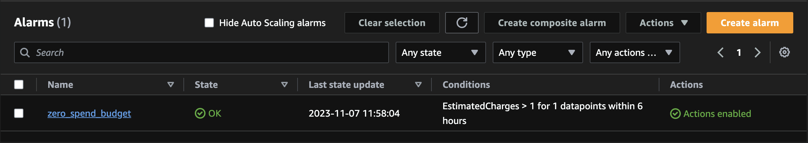

# Terraform AWS Free Tier Billing Alarm
This is a Terraform configuration to create a CloudWatch alarm to keep within AWS free tier limits. Going over the defined threshold will notify via email to the configured address. The stack is deployed to "us-east-1" region as that's where billing data is stored.

Once deployed successfully you will have a CloudWatch alarm configured to notify SNS topic subscriptions:

# Setup
## Local
After cloning this repo locally use the following setups to deploy this to your AWS account:

1. Copy terraform.tfvars.dist to terraform.tfvars
2. Update terraform.tfvars with AWS credentials, valid email address for notification and threshold for monthly spend
3. Run `terraform init` to fetch required provider files
4. Run `terraform plan` checking all resources that will be created
5. Run `terraform apply` to create the CloudWatch alarm, SNS topic and subscription.
6. Once the SNS topic has been created, you should receive an email from AWS. Click the link to confirm the topic subscription and receive any future notifications from this alarm.

### Extra Options
By default the CloudWatch alarm interval is set to 1 hour. You can change this by setting the `cw_alarm_period` terraform variable in terraform.tfvars. This should be type number.

## Github actions
You can use Github actions to deploy this configuration. A plan will be created on PR request and then apply is run once merged into master.

**Note**: For this to work you need to setup a remote backend with s3

1. Fork this repo
2. Setup the below action secrets (Settings > Secrets and Variables > Actions)
3. Make change and open PR to the forked repo
4. Merge PR after confirming terraform plan looks good
5. Once the SNS topic has been created, you should receive an email from AWS. Click the link to confirm the topic subscription and receive any future notifications from this alarm.

### Action Secrets
| Name | Use |
| ------------------ | ------------------------------------------------------------- |
| AWS_ACCESS_KEY     | Access key with permission to access s3 and deploy this stack |
| AWS_SECRET_KEY     | Secret key for the above access key                           |
| CW_ALARM_PERIOD    | Interval for the alarm to view data for                       |
| CW_ALARM_THRESHOLD | Spend limit monthly in USD                                    |
| SNS_ALERT_EMAIL    | Email address used to notify by SNS topic                     |
| TFSTATE_BUCKET     | s3 bucket name used to store tf state                         |
| TFSTATE_KEY        | Path to state file within bucket                              |
| TFSTATE_REGION     | The region the bucket resides in                              |

## Resources used
https://docs.aws.amazon.com/awsaccountbilling/latest/aboutv2/tracking-free-tier-usage.html
https://registry.terraform.io/providers/hashicorp/aws/latest/docs/resources/cloudwatch_metric_alarm
https://registry.terraform.io/providers/hashicorp/aws/latest/docs/resources/sns_topic
https://registry.terraform.io/providers/hashicorp/aws/latest/docs/resources/sns_topic_subscription
https://github.com/github/gitignore/blob/main/Terraform.gitignore

https://github.com/hashicorp/setup-terraform
https://github.com/dflook/terraform-plan